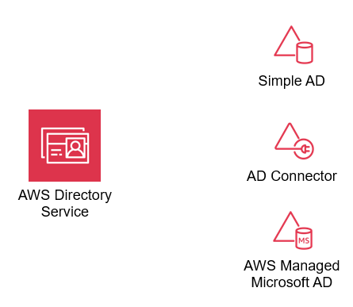
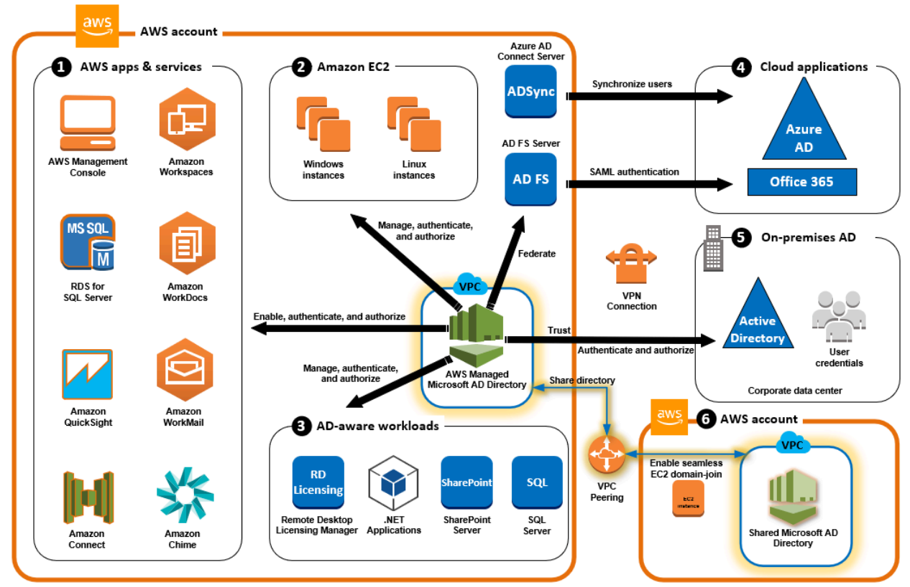

# AWS Active Directory Service Guide

## Overview
AWS Active Directory Service enables seamless integration of Active Directory (AD) features within AWS cloud infrastructure. It provides a fully managed AD environment, supporting use cases like managing user identities, applying group policies, and providing single sign-on (SSO) across AWS applications. AWS offers three main options for integrating AD: **AWS Managed Microsoft AD**, **AD Connector**, and **Simple AD**. Each offers unique capabilities suited to different deployment needs.

    

## Key Features
1. **AWS Managed Microsoft AD**: A managed Microsoft AD on AWS that allows you to use features like group policies, MFA integration, and SSO for both on-premises and cloud applications.
2. **AD Connector**: Acts as a proxy to connect AWS services to an existing on-premises AD without the need for directory synchronization.
3. **Simple AD**: A cost-effective, basic AD-compatible service for simple use cases without advanced features like MFA or trust relationships.
4. **Integration with AWS Services**: Integrates seamlessly with services such as Amazon EC2, Amazon RDS, Amazon WorkSpaces, and more.
5. **Multi-Region Replication**: Provides cross-region redundancy for high availability.
6. **Security**: Includes features like support for Secure LDAP, multi-factor authentication, VPC security integration, and connection logging.

## Components
- **Directory**: A repository of information about users, groups, and devices.
- **Organizational Units (OUs)**: Organize users, groups, and resources for easy management.
- **Group Policies**: Apply policies to users and computers within the directory for consistent configurations and security settings.
- **Schema**: Defines the objects and attributes within the AD and can be extended as needed.
- **Domain Controllers (DCs)**: Essential for directory functioning, providing services like DNS, LDAP, and authentication.
- **Trust Relationships**: Allow users from one domain to access resources in another domain (cross-domain and cross-forest trusts).

## Pricing
1. **AWS Managed Microsoft AD**: Charges are based on the size of the directory (Standard or Enterprise edition) and the number of domain controllers.
2. **AD Connector**: Priced per-hour based on the number of users.
3. **Simple AD**: Similar pricing structure to AWS Managed Microsoft AD but optimized for smaller environments with fewer users.
4. **Additional Charges**:
   - **Data Transfer**: Standard AWS data transfer charges apply for outbound data.
   - **CloudWatch Logs**: Connection logging to CloudWatch incurs standard AWS CloudWatch fees.
   - **Elastic IPs**: For VPCs with Internet Gateways, Elastic IP charges may apply.

## Best Practices
- **Select the Appropriate Directory Type**: AWS Managed Microsoft AD for feature-rich needs, AD Connector for extending on-premises AD, and Simple AD for basic LDAP requirements.
- **Security Practices**: 
  - Use MFA for added security.
  - Enable Secure LDAP (LDAPS) for encrypted communication.
  - Regularly monitor logs with AWS CloudWatch.
- **Avoid Overlapping IP Ranges**: Ensure that client CIDR ranges do not overlap with VPC CIDRs or manually added routes.
- **Enable Multi-Region Replication**: For higher availability, replicate directories across regions.
- **Limit Custom Modifications**: Avoid modifying AWS-created OUs and policies to prevent potential disruptions.

## Working with AWS Directory Service
Administrators can create, manage, and secure an AWS directory through the AWS Management Console, CLI, or API. Integration with IAM allows administrators to manage user permissions and control access to AWS resources. Trust relationships can be established to extend on-premises AD access to AWS, allowing users to access resources with familiar credentials.

### Scenarios and Examples
1. **Access a VPC Using Client VPN**: Set up a single target VPC to grant secure access to VPC resources.
2. **Peered VPC Access**: Configure access to resources in a VPC peered with the target VPC.
3. **On-Premises Network Access**: Establish a VPN connection between an AWS-hosted AD and an on-premises AD.
4. **Internet Access via VPN**: Enable clients to access VPC resources as well as the internet.
5. **Client-to-Client Access**: Allows clients connected to the same Client VPN endpoint to communicate directly.
6. **Restrict Access to Specific Resources**: Utilize authorization rules to restrict user access to specific resources within the VPC.

## Conclusion
AWS Directory Service offers a flexible, fully managed solution for organizations needing Active Directory capabilities in the cloud. By supporting both AWS-hosted and on-premises AD integration, it meets diverse needs for identity management, security, and resource access across cloud and hybrid environments. With options tailored for simple to complex environments, organizations can choose the most suitable directory solution to scale and secure their workloads on AWS.
