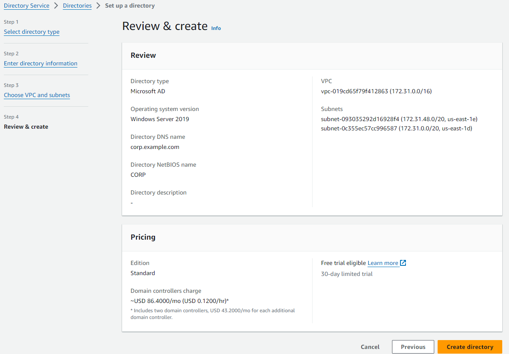

# AWS Managed Active Directory (AD)

## Overview

AWS Managed Microsoft Active Directory (AWS Managed AD) is a fully managed service that enables you to deploy Microsoft Active Directory in the AWS Cloud, seamlessly integrating it with your on-premises infrastructure. It provides a range of Active Directory (AD) functionalities, such as domain joining, Group Policy, and LDAP support, without the operational overhead of maintaining your own Active Directory infrastructure. AWS Managed AD ensures high availability, security, and easy scaling to accommodate the needs of enterprise environments.

    

## Key Features
1. **AWS Managed Microsoft AD**: A managed Microsoft AD on AWS that allows you to use features like group policies, MFA integration, and SSO for both on-premises and cloud applications.
2. **AD Connector**: Acts as a proxy to connect AWS services to an existing on-premises AD without the need for directory synchronization.
3. **Simple AD**: A cost-effective, basic AD-compatible service for simple use cases without advanced features like MFA or trust relationships.
4. **Integration with AWS Services**: Integrates seamlessly with services such as Amazon EC2, Amazon RDS, Amazon WorkSpaces, and more.
5. **Multi-Region Replication**: Provides cross-region redundancy for high availability.
6. **Security**: Includes features like support for Secure LDAP, multi-factor authentication, VPC security integration, and connection logging.

---

## Active Directory Concepts

Active Directory is a centralized directory service used to manage identity and access for resources in a Windows environment. Below are the foundational concepts of Active Directory:

### 1. **Domains**
   - A **domain** is a logical grouping of objects (users, computers, devices, etc.) that share the same Active Directory database.
   - Each domain has its own security policies and trust relationships with other domains.
   - In AWS Managed AD, you can create a **root domain** which can later be expanded into a domain tree.

### 2. **Domain Controllers (DCs)**
   - **Domain Controllers** are servers responsible for handling authentication, enforcing security policies, and managing the replication of the Active Directory database.
   - In AWS Managed AD, **Domain Controllers** are automatically created and spread across multiple availability zones for high availability and fault tolerance.

### 3. **Forest**
   - A **forest** is a collection of one or more domain trees that share a common schema and global catalog. It represents the highest level of the AD hierarchy.
   - The **forest root domain** is the first domain created in a forest, and it controls the schema and configuration for the entire forest.
   - In AWS Managed AD, you start with a single forest containing a single domain, but you can extend this forest to include multiple domains over time.

### 4. **Domain Trees**
   - A **domain tree** consists of multiple domains that share a contiguous namespace.
   - Child domains inherit policies and trust relationships from their parent domains.
   - For example, a domain tree might include `corp.example.com` as the root domain, and `sales.corp.example.com` and `hr.corp.example.com` as child domains.

### 5. **Trusts**
   - **Trusts** define relationships between two domains that allow users in one domain to access resources in another.
   - There are several types of trusts:
     - **Parent-child trust**: A default trust relationship that exists between a parent domain and its child.
     - **External trust**: A trust between domains in different forests.
     - **Forest trust**: A trust between two forests, allowing users in one forest to access resources in another.

### 6. **Organizational Units (OUs)**
   - An **Organizational Unit (OU)** is a container within a domain used to organize objects such as users, groups, and computers.
   - OUs provide a way to apply Group Policies and manage permissions on a more granular level.
   - For example, an OU might represent a department within an organization (e.g., "Sales" or "IT"), and different policies or administrative permissions can be applied to that OU.
   - In AWS Managed AD, you can use OUs to replicate your on-premises organizational structure or create new OUs to suit your cloud-based needs.

---

## AWS Managed Active Directory

### 1. **AWS Managed Microsoft AD**

To get started with AWS Managed AD, you will need to create an AWS Directory Service instance:

- Go to **AWS Directory Service** in the AWS Management Console.
- Choose **Set up Directory** and then select **AWS Managed Microsoft AD**.
- Enter the required details like:
  - **Directory DNS Name**: e.g., `corp.example.com`
  - **NetBIOS Name**: e.g., `CORP`
  - **Admin Password**: Password for the Directory Admin.

Once created, AWS will automatically provision Domain Controllers across multiple availability zones to ensure high availability.

### 2. **Domains, Domain Controllers, and Trust Relationships**

When AWS sets up your directory, it automatically creates:
- **Primary Domain Controllers (PDCs)** in two availability zones.
- Trust relationships between your AWS Managed AD and other domains, if required.

AWS automatically manages the replication between Domain Controllers.

### 3. **Working with Organizational Units (OUs)**

Once your directory is set up, you can create OUs:
- **Steps to create OUs**:
  1. Connect to your AWS Managed AD instance using the **AD Administrative Tools** (like Active Directory Users and Computers).
  2. Navigate to your domain (`corp.example.com`), right-click, and select **New Organizational Unit**.
  3. Enter the name of the OU (e.g., "IT Department").
  
- After the OU is created, you can create users, groups, and computers within the OU and apply Group Policies.

---

## Active Directory Components in AWS Managed AD

### 1. **Global Catalog**
   - A **Global Catalog** contains information about every object in the forest. It helps to search for objects across domains in the forest.
   - In AWS Managed AD, the Domain Controllers are automatically configured as Global Catalog servers.

### 2. **Replication**
   - **Replication** ensures that changes made to the AD database on one Domain Controller are copied to other Domain Controllers.
   - AWS Managed AD handles replication automatically across the Domain Controllers in different availability zones.

### 3. **FSMO Roles**
   - **Flexible Single Master Operations (FSMO)** roles are special roles assigned to one or more Domain Controllers within a forest.
   - These roles are critical for the proper functioning of the AD environment:
     - **Schema Master**: Controls changes to the AD schema.
     - **Domain Naming Master**: Manages adding/removing domains in the forest.
     - **RID Master**: Allocates relative IDs (RIDs) to objects within the domain.
     - **PDC Emulator**: Acts as the authoritative source for time and manages password changes.
     - **Infrastructure Master**: Updates references to objects in other domains.

---

## Active Directory Controller in AWS

In AWS Managed AD, the **Domain Controllers (DCs)** are the core components that manage authentication and directory services. AWS handles the following for Domain Controllers:

- **Multi-AZ Deployment**: AWS automatically deploys two Domain Controllers in separate availability zones.
- **Automatic Patching**: AWS manages patching and maintenance of Domain Controllers to keep them secure.
- **Monitoring and Backups**: AWS provides monitoring and daily backups of Domain Controllers.
  
**Note**: AWS Managed AD is not accessible for direct administrative changes at the operating system level. You can only interact with the Active Directory via the typical AD tools.

---

## Best Practices

1. **OU Design**: Structure your OUs in a way that aligns with your organization's departments and delegation needs. Use OUs to apply Group Policies effectively.
2. **Use Trust Relationships**: Leverage **trusts** to integrate AWS Managed AD with your on-premises AD infrastructure.
3. **Replication**: Monitor replication between Domain Controllers to ensure consistency in your directory data.
4. **Security**: Regularly audit Group Policies and permissions to ensure secure access control.

---

# AWS Managed Active Directory Service Setup Guide

This guide provides a step-by-step approach to setting up an AWS Directory Service using **AWS Managed Microsoft AD**. AWS Managed Microsoft AD enables you to deploy a fully managed Active Directory in the AWS Cloud, supporting seamless integration with AWS services and on-premises resources.

1. [Step 1: Select Directory Type](#step-1-select-directory-type)
2. [Step 2: Enter Directory Information](#step-2-enter-directory-information)
3. [Step 3: Choose VPC and Subnets](#step-3-choose-vpc-and-subnets)
4. [Step 4: Review and Create](#step-4-review-and-create)

AWS Directory Service provides multiple options for running directory services on AWS, including **AWS Managed Microsoft AD**, **Simple AD**, and **AD Connector**. This guide focuses on setting up **AWS Managed Microsoft AD**, which provides a fully managed Microsoft Active Directory and supports seamless integration with AWS services.

## Step 1: Select Directory Type

1. Navigate to the **AWS Directory Service** dashboard in the AWS Management Console.
2. Click on **Set up directory** to start the setup process.
3. Select **AWS Managed Microsoft AD** as the directory type.

   - **AWS Managed Microsoft AD** provides a managed, high-availability Microsoft Active Directory in the AWS Cloud that you can use with other AWS services or your on-premises Active Directory.

   

## Step 2: Enter Directory Information

1. In the **Directory information** section, fill out the required fields:
   - **Directory DNS name**: Enter the fully qualified domain name (FQDN) for the directory, such as `corp.example.com`.
   - **NetBIOS name**: Specify a short name for the directory (e.g., `CORP`).
   - **Description (optional)**: Provide a brief description of the directory.
   - **Edition**: Choose the edition that best fits your needs, either **Standard** or **Enterprise**.
   
   - **Standard Edition**: Suitable for smaller deployments (up to 5,000 users).
   - **Enterprise Edition**: Suitable for larger deployments (up to 100,000 users).

   
   

## Step 3: Choose VPC and Subnets

1. Select the **VPC** in which you want to deploy the directory.
2. Choose two **subnets** in different Availability Zones (AZs) within the VPC. AWS Managed Microsoft AD requires at least two subnets for redundancy and high availability.
   - The directory will deploy a Domain Controller in each of the selected subnets.
   
   **Note**: Make sure that the subnets have adequate network access for Active Directory services and any additional integrations you may plan.

   

## Step 4: Review and Create

1. Review all the information you have entered to ensure it is correct.
2. Click on **Create directory** to initiate the setup.
3. AWS will begin provisioning your AWS Managed Microsoft AD. This process may take several minutes.
   
   **Important**: Once the directory is created, you can configure additional settings such as **Trust relationships**, **Single Sign-On (SSO)**, and **Group Policies** if needed.

   

After completing these steps, your AWS Managed Microsoft AD will be up and running. You can now use it to manage your AWS resources, integrate with on-premises AD, or implement SSO for AWS services. AWS Managed Microsoft AD simplifies Active Directory management by automating deployment, patching, and backup tasks, allowing you to focus on your core business operations.

For additional configurations or advanced settings, refer to the [AWS Directory Service documentation](https://docs.aws.amazon.com/directoryservice/latest/admin-guide/directory_microsoft_ad.html).

**Note**: Ensure that security groups, IAM permissions, and network configurations are appropriately set up to allow your applications and users to access the directory services.

---

## Pricing
1. **AWS Managed Microsoft AD**: Charges are based on the size of the directory (Standard or Enterprise edition) and the number of domain controllers.
2. **AD Connector**: Priced per-hour based on the number of users.
3. **Simple AD**: Similar pricing structure to AWS Managed Microsoft AD but optimized for smaller environments with fewer users.
4. **Additional Charges**:
   - **Data Transfer**: Standard AWS data transfer charges apply for outbound data.
   - **CloudWatch Logs**: Connection logging to CloudWatch incurs standard AWS CloudWatch fees.
   - **Elastic IPs**: For VPCs with Internet Gateways, Elastic IP charges may apply.

## Best Practices
- **Select the Appropriate Directory Type**: AWS Managed Microsoft AD for feature-rich needs, AD Connector for extending on-premises AD, and Simple AD for basic LDAP requirements.
- **Security Practices**: 
  - Use MFA for added security.
  - Enable Secure LDAP (LDAPS) for encrypted communication.
  - Regularly monitor logs with AWS CloudWatch.
- **Avoid Overlapping IP Ranges**: Ensure that client CIDR ranges do not overlap with VPC CIDRs or manually added routes.
- **Enable Multi-Region Replication**: For higher availability, replicate directories across regions.
- **Limit Custom Modifications**: Avoid modifying AWS-created OUs and policies to prevent potential disruptions.

## Use Cases for AWS Managed Active Directory

Administrators can create, manage, and secure an AWS directory through the AWS Management Console, CLI, or API. Integration with IAM allows administrators to manage user permissions and control access to AWS resources. Trust relationships can be established to extend on-premises AD access to AWS, allowing users to access resources with familiar credentials.
- **Hybrid Cloud**: Integrate AWS Managed AD with your on-premises AD infrastructure using **AD Trusts**. This allows seamless access between cloud and on-premises resources.
- **AWS Services Integration**: Use AWS Managed AD with services like Amazon WorkSpaces, Amazon RDS for SQL Server, and Amazon EC2 for Windows.
- **Identity and Access Management**: Manage users, groups, and permissions across multiple AWS accounts using AD and AWS IAM.
  
---

### Scenarios and Examples
1. **Access a VPC Using Client VPN**: Set up a single target VPC to grant secure access to VPC resources.
2. **Peered VPC Access**: Configure access to resources in a VPC peered with the target VPC.
3. **On-Premises Network Access**: Establish a VPN connection between an AWS-hosted AD and an on-premises AD.
4. **Internet Access via VPN**: Enable clients to access VPC resources as well as the internet.
5. **Client-to-Client Access**: Allows clients connected to the same Client VPN endpoint to communicate directly.
6. **Restrict Access to Specific Resources**: Utilize authorization rules to restrict user access to specific resources within the VPC.

## Conclusion
AWS Directory Service offers a flexible, fully managed solution for organizations needing Active Directory capabilities in the cloud. By supporting both AWS-hosted and on-premises AD integration, it meets diverse needs for identity management, security, and resource access across cloud and hybrid environments. With options tailored for simple to complex environments, organizations can choose the most suitable directory solution to scale and secure their workloads on AWS.
